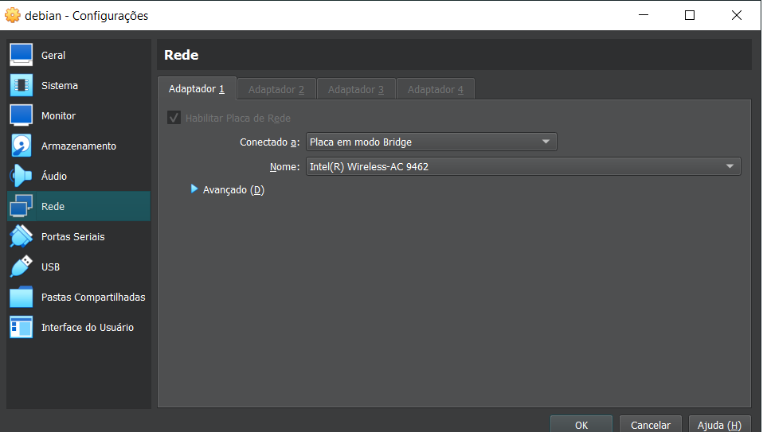
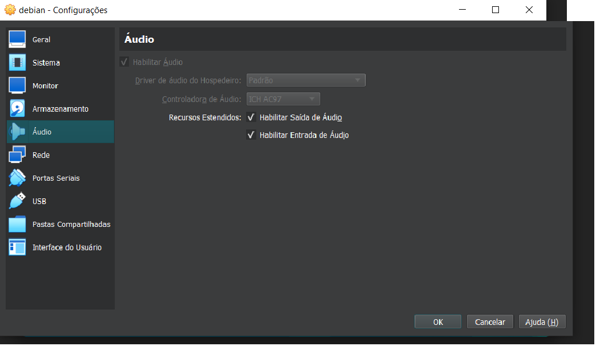
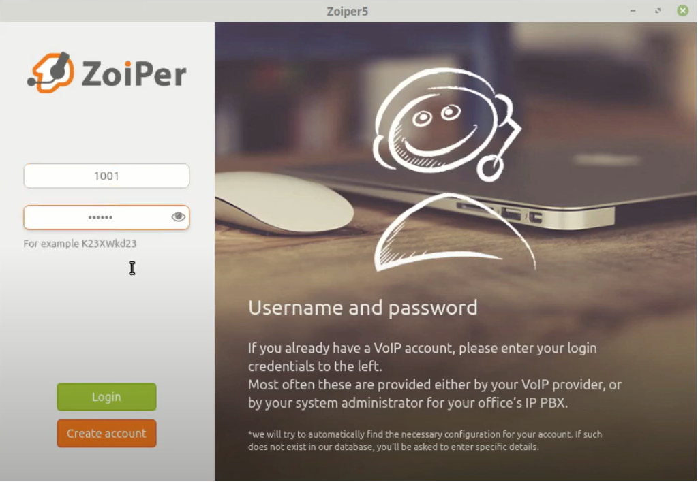
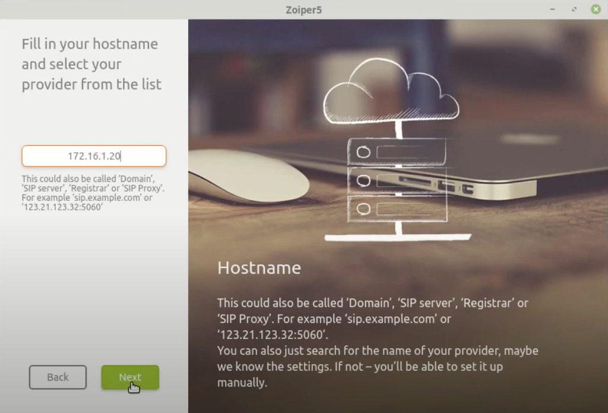
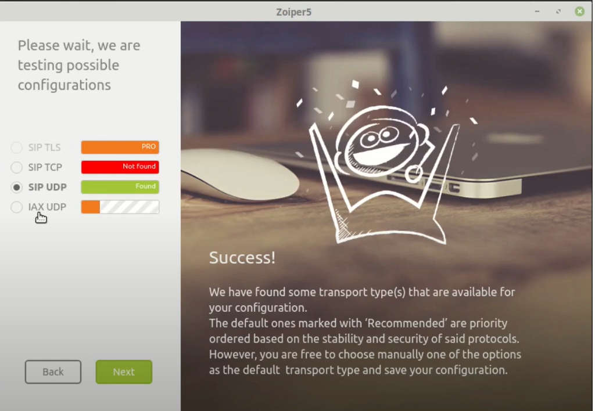
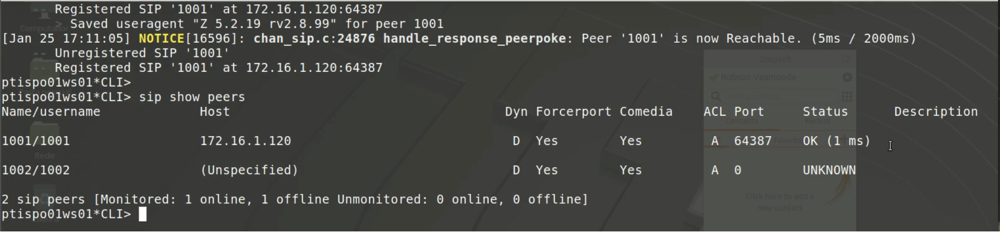
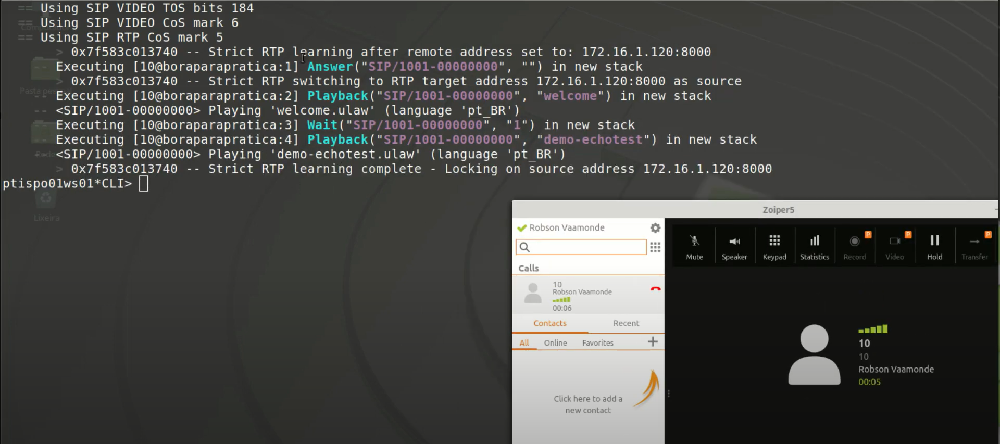
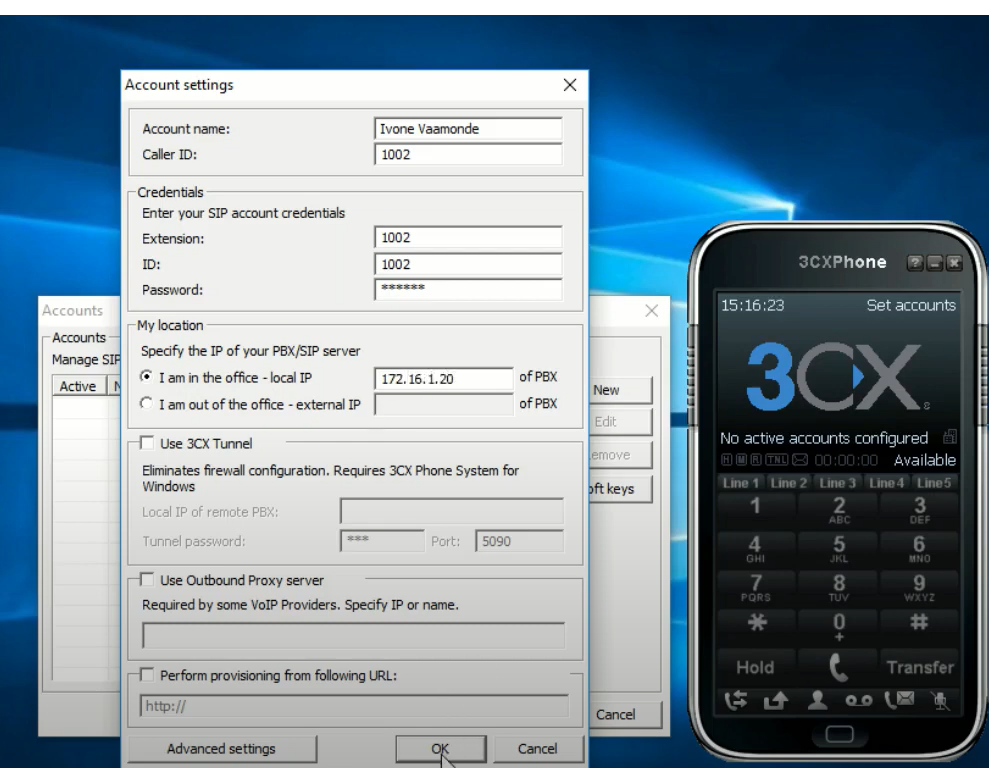
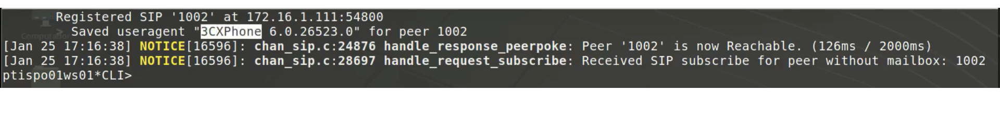
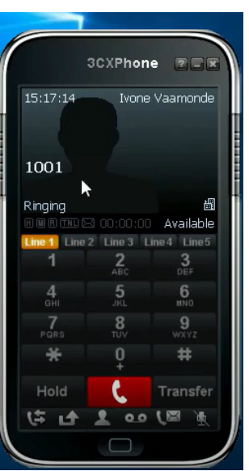

# Configuração do Asterisk no GNU/Linux Debian

Neste guia, você aprenderá a configurar o **Asterisk** em uma máquina virtual Debian. No meu caso, foi necessário alterar as configurações de rede de **NAT** para **Bridge** para garantir a comunicação adequada do servidor Asterisk.



## Sumário

1. [Acessar o Terminal como Superusuário](#1-acessar-o-terminal-como-superusuário)
2. [Acessar o Diretório de Configuração do Asterisk](#2-acessar-o-diretório-de-configuração-do-asterisk)
3. [Editar o Arquivo `modules.conf`](#3-editar-o-arquivo-modulesconf)
4. [Editar o Arquivo `sip.conf`](#4-editar-o-arquivo-sipconf)
5. [Editar o Arquivo `extensions.conf`](#5-editar-o-arquivo-extensionsconf)
6. [Reinicializar o Serviço Asterisk](#6-reinicializar-o-serviço-asterisk)
7. [Verificar o Status do Serviço](#7-verificar-o-status-do-serviço)
8. [Acessar o Console do Asterisk](#8-acessar-o-console-do-asterisk)
9. [Recarregar Configurações do Asterisk](#9-recarregar-configurações-do-asterisk)
10. [Verificar Ramais e Planos de Discagem](#10-verificar-ramais-e-planos-de-discagem)
11. [Habilitar Áudio na Máquina Virtual](#11-habilitar-áudio-na-máquina-virtual)
12. [Baixar e Instalar o Zoiper](#12-baixar-e-instalar-o-zoiper)
13. [Fazer Login no Zoiper](#13-fazer-login-no-zoiper)
14. [Configurar o IP no Zoiper](#14-configurar-o-ip-no-zoiper)
15. [Configurar Proxy no Zoiper](#15-configurar-proxy-no-zoiper)
16. [Configurar SIP UDP no Zoiper](#16-configurar-sip-udp-no-zoiper)
17. [Registrar Ramal no Zoiper](#17-registrar-ramal-no-zoiper)
18. [Testar o Ramal no Zoiper](#18-testar-o-ramal-no-zoiper)
19. [Configurar Softphone no Windows](#19-configurar-softphone-no-windows)
20. [Verificar Registros no Terminal](#20-verificar-registros-no-terminal)
21. [Discar pelo Softphone](#21-discar-pelo-softphone)
22. [Considerações Finais](#considerações-finais)

---


## 1. Acessar o terminal como Superusuário

```
su
```

## 2. Acessar o Diretório de Configuração do Asterisk

```
cd /etc/asterisk/
```
 - Listar os arquivos
    ```
    ls
    ```
## 3. Editar o arquivo ```modules.conf```
Esse arquivo é responsável por inicializar todos os modulos que vão iniciar junto com o asterisk.

Para editar o arquivo basta digitar o código abaixo.
```
nano modules.conf
```
[Veja o conteúdo do arquivo modules.conf](./arquivos%20conf/modules.conf)

## 4. Editar o arquivo ```sip.conf```

Esse é o arquivo de ramais.

Para editar o arquivo basta digitar o código abaixo.
```
nano sip.conf
```

[Veja o conteúdo do arquivo sip.conf](./arquivos%20conf/sip.conf)


## 5. Editar o arquivo ```extensions.conf```

Esse é o arquivo de plano de discagem.

Para editar o arquivo basta digitar o código abaixo.
```
nano extensions.conf
```

[Veja o conteúdo do arquivo extensions.conf](./arquivos%20conf/extensions.conf)

## 6. Reinicializar o Serviço Asterisk

Sempre quando realizar alguma alteração nos arquivos mencionados anteriomente, é interessante reinicializar os serviços.

```
systemctl restart asterisk.service
```` 

## 7. Verificar o Status do Serviço

```
systemctl status asterisk.conf
```

## 8. Acessar o console do asterisk

```
asterisk -rvv
```

- Caso apareça a mensagem **asterisk: command not found** faça o seguinte passo: 

  1. Adicionar o PATH permanentemente: Para que a alteração no PATH seja permanente, edite o arquivo .bashrc ou .profile (dependendo da sua configuração de shell) e adicione a linha:
   
        ```
        export PATH=$PATH:/usr/sbin
        ```

   2. Salve o arquivo e, para aplicar a mudança, rode:

        ```
        source ~/.bashrc
        ```

        **Ou, se estiver usando .profile:**

        ```
        source ~/.profile
        ```
    
    3. Após essas alterações basta rodar o comando novamente.

## 9. Recarregar Configurações do Asterisk

```
sip reload
```

```
dialplan reload
```

## 10. Verificar Ramais e Planos de Discagem
```
sip show peers
```

```
dialplan show
```

## 11. Habilitar Áudio na Máquina Virtual

Nas configurações da máquina virtual é necessário habilitar os áudios de saída e de entrada, caso você queira usar um fone de ouvido.




## 12. Baixar e Instalar o Zoiper

-  Zoiper 5.6.4 (64 bits):
[Acesse  ](./software/Zoiper5_5.6.4_x86_64.deb)

## 13. Fazer Login no Zoiper

No campo ```usuário``` coloque o ramal ```1001```

E no campo ```senha``` coloque a senha anteriomente configurada nos arquivos conf anteriores, sendo a senha ```123456```



## 14. Configurar o IP no Zoiper
  

  **Para saber o seu ip digite no terminal:**

  ```
  ip a
  ```


## 15. Configurar Proxy no Zoiper
Não irei utilzar a parte de proxy. Portanto basta clicar em ```skip```

## 16. Configurar SIP UDP no Zoiper

Ao carregar o protocolo ```SIP UDP``` basta clicar ```Next```

 

 ## 17. Registrar Ramal no Zoiper
 Apos entrar na tela inicial do Zoiper, o ramal 1001 já estará registrado. Para ter certeza, basta digitar no terminal:

 ```
 sip show peers
 ```

 E deve está algo parecido como:
 

 ## 18. Testar o Ramal no Zoiper
No ZoiPer basta digitar o numero 10 para fazer o primeiro teste

E deve está algo parecido como:
 

 - **Ao ligar para o número 20 você irá ouvir o número do seu ramal.**

 ## 19. Configurar Softphone no Windows

 Vamos agora acessar o windows e baixar o seguinte aplicativo 3CX
 
 [Acesse a versão utilizada no teste ](./software/3CXPhone6.msi)

  - 1. Crie um perfil de conta
    - 1.1 - Clique em **Create Profile**

        1.2. Após em **New**

        1.3 Nos campos devem ficar da seguinte forma

        **Account Name: Alan
        Caller ID: 1002
        Extension: 1002
        ID: 1002
        Password: 123456
        Local IP: 172.16.1.20 (meu ip/seu ip)**

        1.4 Clicar em **ok** e depois em **ok** novamente.

         

## 20. Verificar Registros no Terminal
No terminal, basta apenas verificar se houve alguma atualização.



## 21. Discar pelo Softphone

Para finalizar basta apenas ligar pelo 3CXphone para o ramal 1001




## Considerações Finais
Este guia abrange os passos essenciais para configurar o Asterisk em uma máquina Debian, incluindo a configuração de rede, edição de arquivos de configuração, instalação e configuração de softphones. Certifique-se de seguir cada etapa cuidadosamente e verificar as configurações de rede e firewall para garantir uma operação sem problemas.

Se encontrar algum problema ou tiver dúvidas, sinta-se à vontade para abrir uma issue ou contribuir com sugestões para aprimorar este guia.